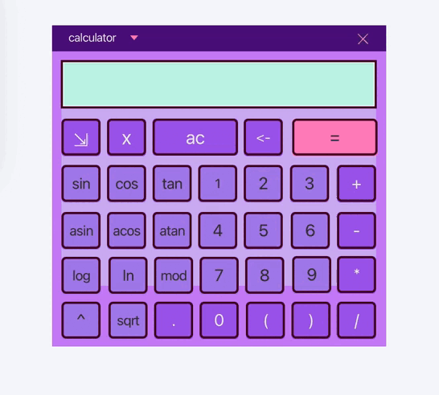

# SmartCalculator

В проекте реализован калькулятор с возможностью вычисления арифметических операций и математических функций.

Расчет производится с использованием обратной польской нотации.

В отдельном окне можно построить график функции, изменить масштаб и область определения функции.

Есть возможность вычисления арифметических выражений с подстановкой значения переменной x в виде числа.

Программа поддерживает скобочные выражения, унарные операторы и числа в экспоненциальной системе счисления.

Интерфейс программы реализован на базе JavaFX/SceneBuilder. В проекте используется паттерн MVC.

